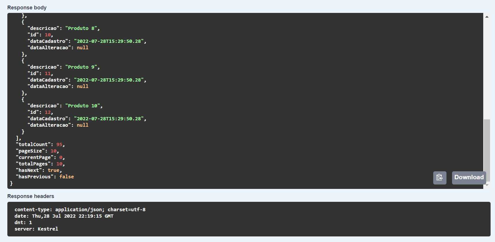
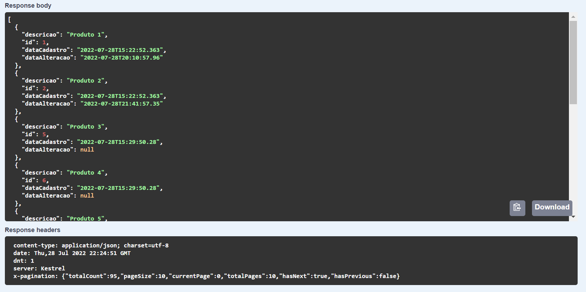
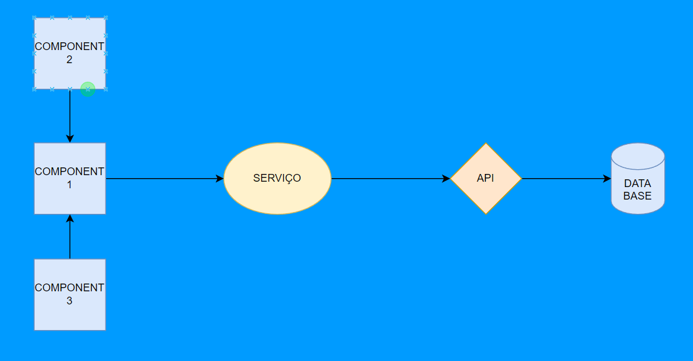
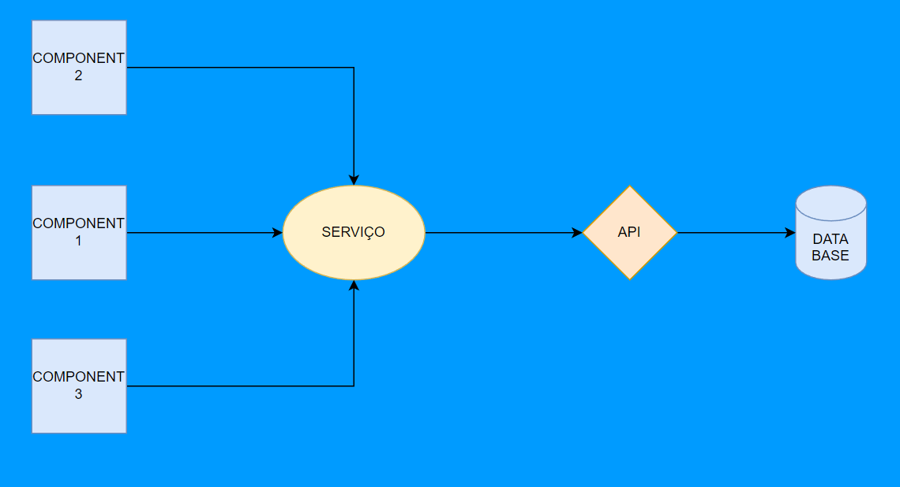
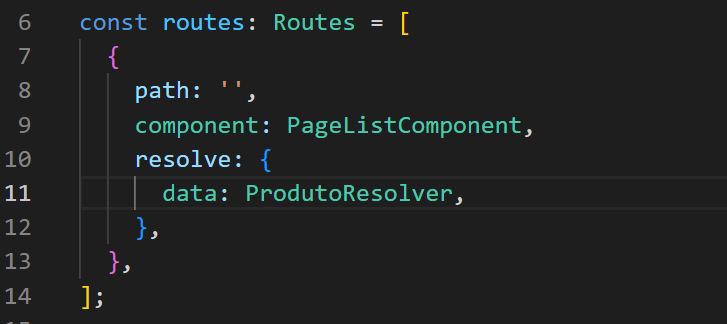
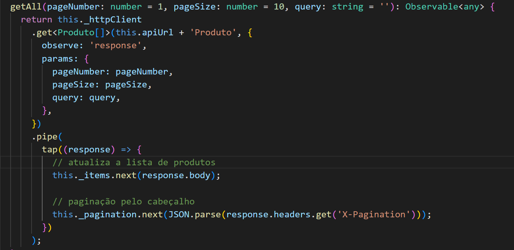
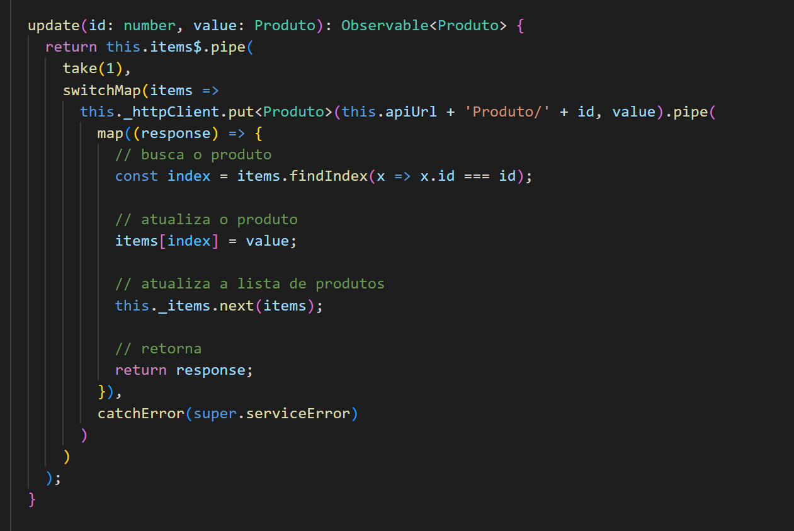
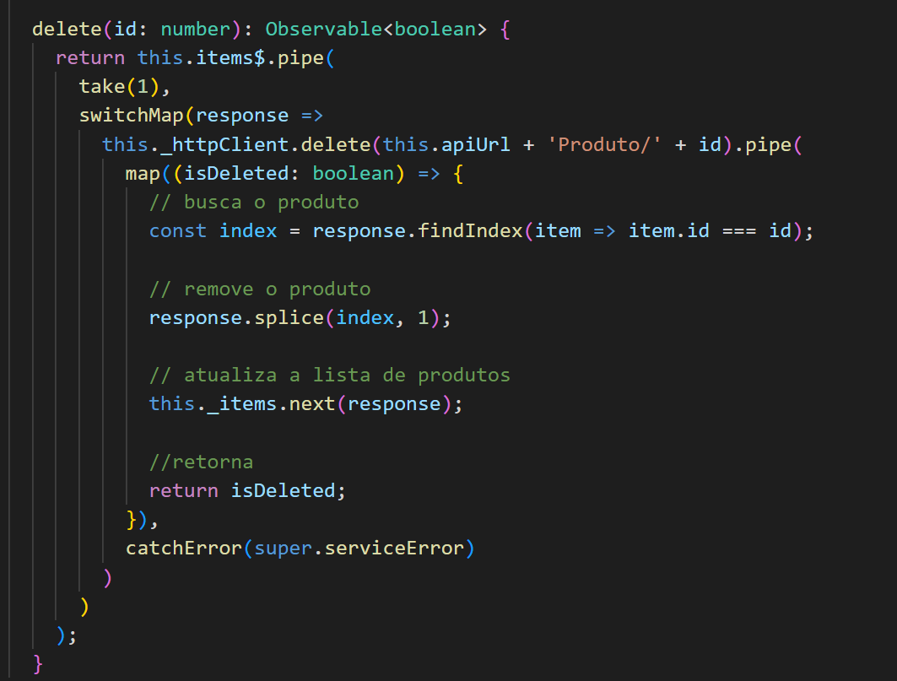
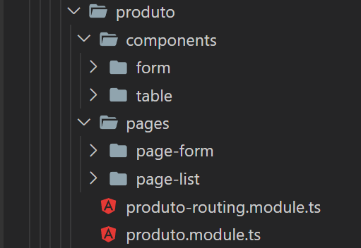

# POC 1

- (back-end ) POC abordando conceito de paginação utilizando o cabeçalho (header) e o corpo(body) para apresentar informações referente a paginação (total, pagesize, currentpage, totalpages, etc).
- (front-end) Lógica concentrada no serviço (service) para compartilhamento e atualização de informações (produtos).

By Guilherme Lima - guyga89@gmail.com

# Back

- Paginação retornando informações no corpo (body)

- Paginação retornando informações no cabeçalho (header) - x-pagination

# Front

- Lógica utilizando o componente 1 para armazenar e manipular os dados

- Lógica utilizando serviço para armazenar e manipular os dados

- Fazendo uso de resolver para obter dados durante a navegação - ProdutoResolver

- Método para obter lista e armazenar lista no serviço (service)

- Método para atualizar um item específico da lista

- Método para remover um item específico da lista

- Estrutura de pastas em cada módulo separando componente (component) por página (page)

