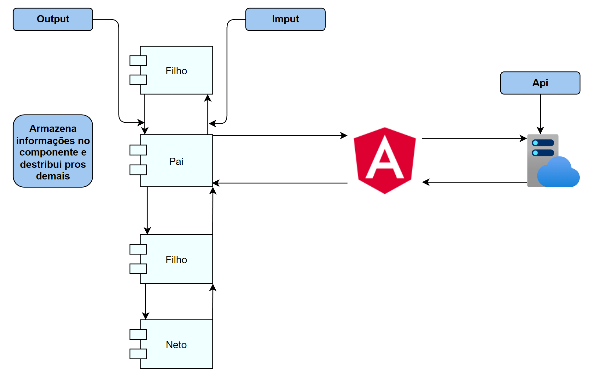
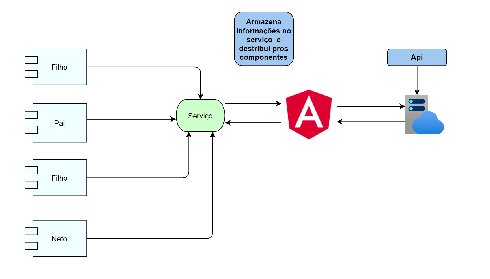
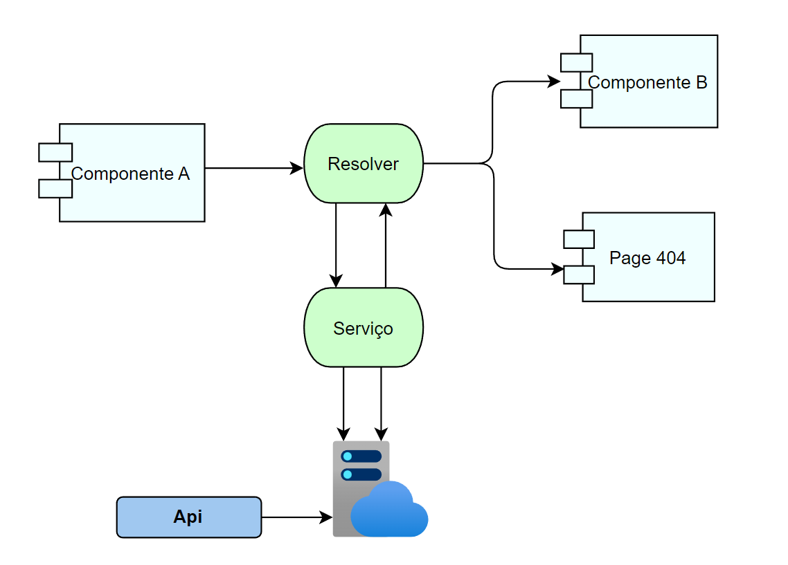
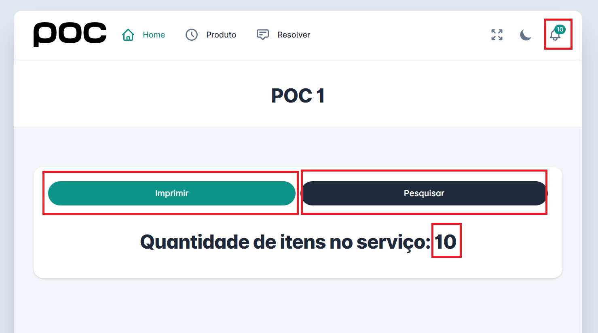
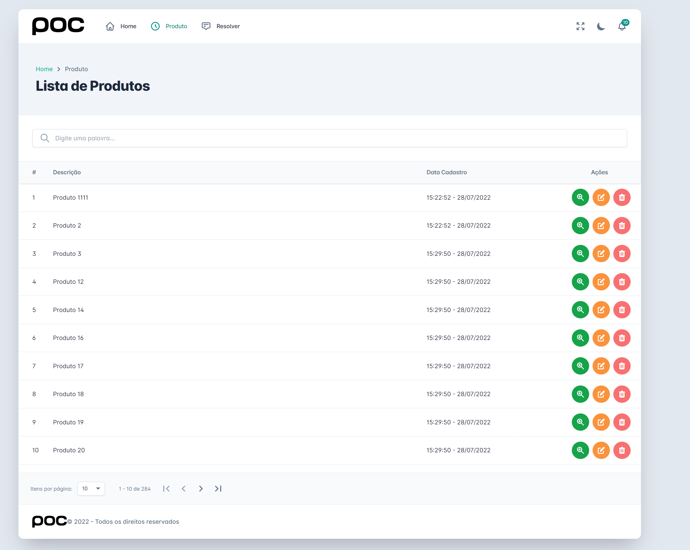
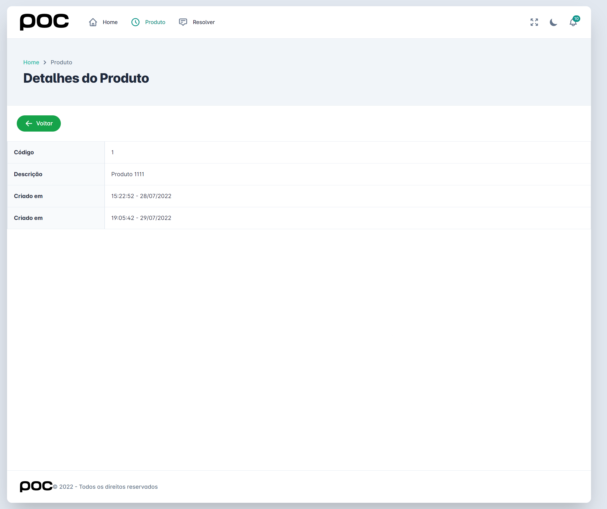
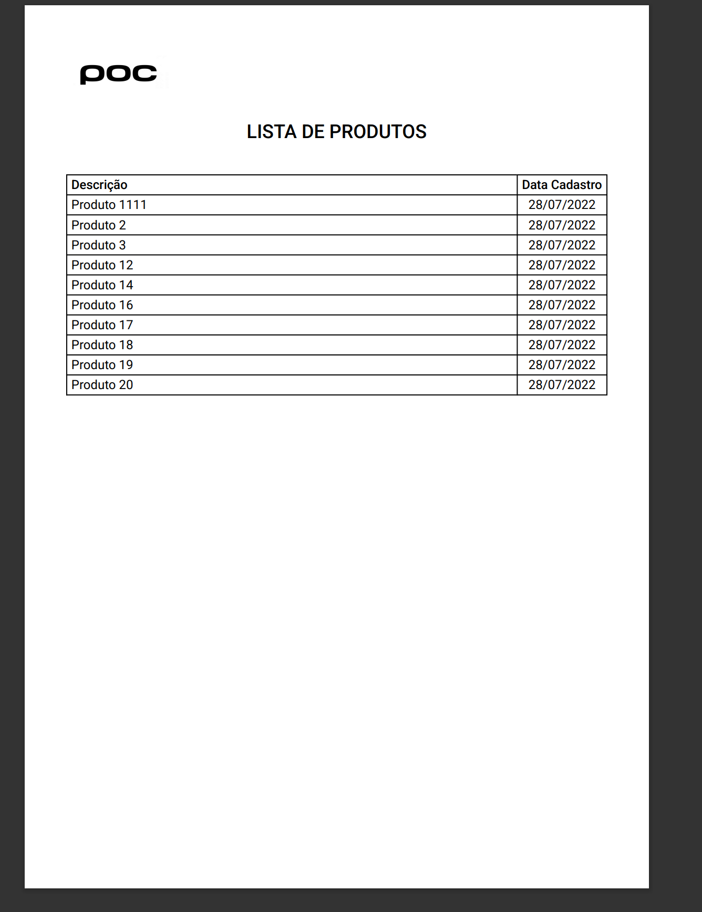

# ANGULAR RESOLVER

## Back-End

- Net 6
- Dapper
- EF Core
- Swagger
- Pagination

## Front-End

- Angular
- Angular Material
- Tailwind
- PDFMake
- Pagination
- Resolver

#

# Front

### POC abordando lógica concentrada no serviço para compartilhamento e atualização de informações (produtos).

#

- Lógica utilizando o componente Pai para armazenar e distribuir os dados.

- Lógica utilizando serviço para armazenar e distribuir os dados.

- Lógica utilizando resolver.

- Exemplo de descentralização.

- Página de listagem (utilizando resolver).

- Detalhes do produto (utilizando resolver).

- Exemplo de geração de PDF (PDFMake).

